## Jvusialvm vs FusionReactor

## Table of content
1. [Introduction](#introduction)
2. [Java profiling](#java-profiling)
3. [FusionReactor vs Jvisualvm](#fusionreactor-vs-jvisualvm)
    1. [GUI vs Web](#gui-vs-web)
    2. [Default page](#default-page)
    3. [Main JVM metrics](#main-jvm-metrics)
        1. [GC](#gc)
        2. [Memory monitoring](#memory-monitoring)
        3. [JIT](#jit)
        4. [Threads](#threads)
        5. [JDBC](#jdbc)
        6. [System resources](#system-resources)
4. [Conclusion](#conclusion)

## Introduction
A lot of new customers who have never tried to monitor their Java applications with FusionReactor might wonder what FusionReactor can do that Jvisualvm can't ,
If you have the same question in mind then welcome to a new article where we tried to compare both tools so you can decide which will work best for your use cases.

## Java profiling
Application profiling in general is a hard task. The usual purpose of profiling is to determine which sections of a program to optimize to increase its overall speed. Luckily , the awesome ecosystem of JVM makes it much easier for regular developers. 
But first you need to answer the simple question. What kind of monitoring do you need for your business. Do you want to know how Garbage Collector(GC) behaves in the pick overloads or the class name that eats all of the available heap space ? If you answer yes to all then Jvisualvm and FusionReactor are good starting point for you. 
The curious reader might ask , how do these tools work under the hood ? How does the FusionReactor collect the metrics of your running java process ? The answer is **Java agents**

### Java agents
Java agents are a special type of class which, by using the Java Instrumentation API, can intercept applications running on the JVM, modifying their bytecode. The dynamic nature of Java makes it really easy to add these interceptors on the fly or specify agent as a command line argument to your application and if you will take a closer look at FusionReactor setup guide you will see that it literally asks you to specify an agent
```
java  -javaagent:/home/strogiyotec/Java/fusion/fusionreactor.jar -agentpath:/libfrjvmti_x64.so -jar application.jar
```

## FusionReactor vs Jvisualvm
Before we start, let's have a brief introduction to Jvisualvm . According to Oracle, `jVisualVM is a visual tool integrating commandline JDK tools and lightweight profiling capabilities. Designed for both development and production time use`. It's distributed as a part of jdk installed in the host machine.
Now let's walk through a step by step comparison of both technologies. 
### GUI vs Web
In essence , Jvisualvm is a GUI program written in Swing framework. Here comes the first difference, the only way to access FusionReactor is through the web browser while Jvisualvm has to be installed in the host machine to use it.
There are two main drawbacks here. The main one is that Jvisualvm is a Swing application and you must install the java runtime to use it(unless you are using [Graalvm](https://www.graalvm.org/) which can ship Jvisualvm as a platform dependent binary with embedded java runtime). What is the big deal here ? Our team in FusionReactor believes that fast response to production level problems is essential for all businesses in respect to their customers. In case when the dev team is not available , non technical people won't be able to(without proper training) install jdk , launch Jvisualvm , connect to the production environment and take a live snapshot of the issue. With FusionReactor it is just a matter of opening a new tab in the browser that everyone with an internet connection can do .

### Default page
Now let's compare both user interfaces. But first we need a project that we will monitor. For this purpose we will use a simple spring-boot based hello-world web project build with maven as a single [fat jar](https://docs.spring.io/spring-boot/docs/current/reference/html/executable-jar.html). The application is running on port 8080 and has a single GET endpoint `/hello` which inserts a random row into the in memory H2 database. The source code is available [here](https://github.com/strogiyotec/fusion-reactor-jvisualvm-blog). In order to build and run this project you need to copy and paste the following command(within the repository folder) into the terminal `mvn clean package && java -jar target/fusion-reactor.jar`.  Refer to [FusionReactor documentation page](https://docs.fusion-reactor.com/) on how to attach java agent to this standalon java program.  Now when the project is up and running let's open jvisualvm( typing `jvisualvm` in terminal should be enough if you have jdk installed).

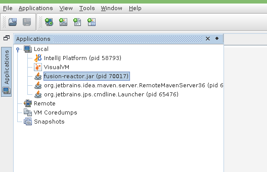

From this list choose your application by pid(in this case it's 70017)
Here is how the user interface in Jvisualvm will look like for openjdk 11 
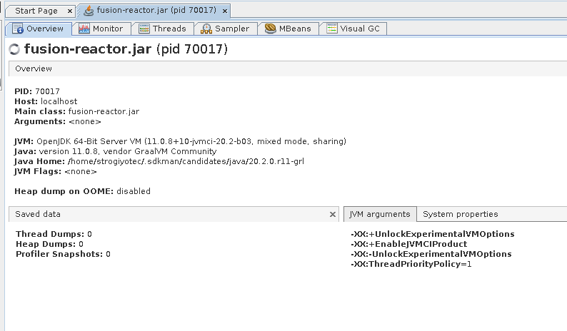
In the default **Overview** tab you can see
1. JVM flags that were passed to java process(in this case no flags)
2. The JVM version and vendor
3. Other system properties

What about FusionReactor ? First you need to run the jar file with java agent attached. The command will look like this
```
java  -javaagent:/fusionreactor.jar=address=8088 -agentpath:/libfrjvmti_x64.so -Dfrlicense=LICENSE_NUMBER -Dfradminpassword=COMPICATED_PASSWORD -jar fusion-reactor.jar
```
After the app was deployed you need to open an admin page in the browser with the following url `http://localhost:8088` (the password will be the one you specified during the deploy with `Dfradminpassword` parameter). 
Here is how the default interface will look for you
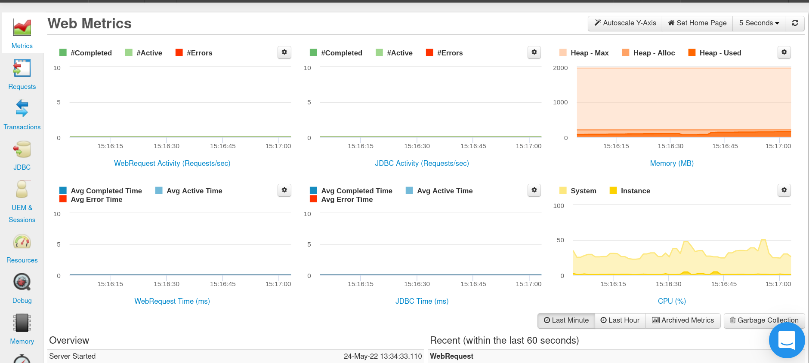
First you can see that the interface has a lot more tabs compared with Jvisualvm. Next , the default page can be configured by opening the tab you are interested in and pressing the **Set home page** button. In the screen above the Metrics tab was used as a default tab.

## Main JVM metrics
In this section we are going to compare how both tools deal with default JVM metrics such as Garbage collection, memory monitoring , Thread activity and Just in time compilation(JIT)
### GC
Both Jvisualvm and FusionReactor support insides of the garbage collector used by the application. The screen below shows how GC tab looks like in Jvisualvm
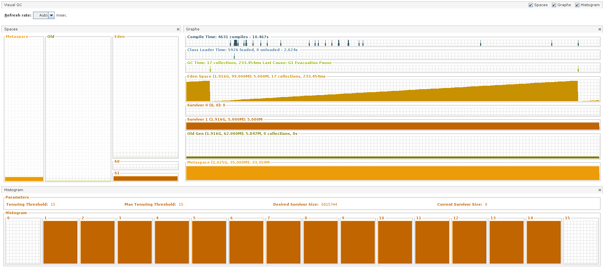
You can see main GC statistics here such as 
1. Amount of collections
2. Eden , Survivor , Old and Metaspace sizes. 
   
Refresh rate for the statistics can be adjusted with dropdown in the top left corner. We in FusionReactor don't like this interface because it's really hard to answer the main question here, specifically which garbage collector is used by the application. As you know there are many GC types the jdk ships, the default one varies from version to version and also depends on the jdk vendor. In order to adjust GC settings in order to gain performance we first need to understand which collector is used by the application.  Jvisualvm shows a small green label namely **G1 Evaluation Pause** so we can understand that Garbage First(G1) collector is used.

Now let's take a look at FusionReactor interface. First go to the **Resources** tab and then open **Garbage collection** section. Here is how the page might look 
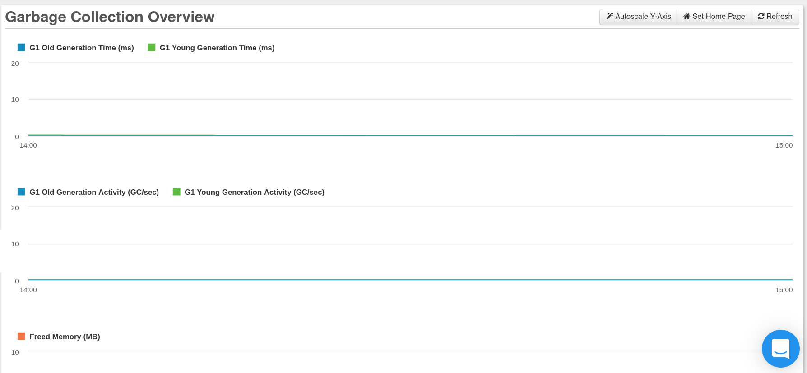
First we made it really easy to see which collector is used (G1 in this case).  All graphs look almost the same as in Jvisualvm so new users coming from Jvisualvm won't have any trouble  understanding the UI. The biggest advantage here is that all gc logs are preserved so you can see the past statistics. With Jvisualvm you will have to collect GC logs manually.

### Memory monitoring 
The next thing we will look at is Memory monitoring page. Let's start with Jvisualvm
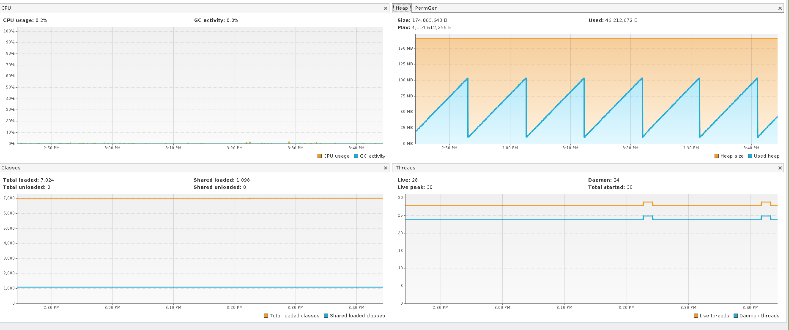

As you can see Jvisualvm doesn't show you much , amount of heap used is a good metric to start with, but not enough to troubleshoot an actual cause of the memory related issue. 

How is FusionReactor different ? 
Actually FusionReactor doesn't have a single tab for memory monitoring. If you open **Resources** tab you will see a list of available pages each of which is dedicated to specific memory metric. The default one is **Memory overview** which looks like this 
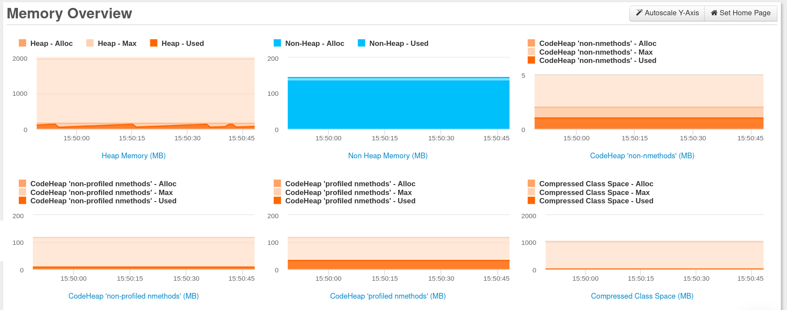
It shows heap , non heap , code heap and compressed class space and of course as with garbage collection, all metrics are preserved too see the past memory metrics. Most java based servers are running on top of servlet containers such as Tomcat or Jetty , if you need to see how many buffers are used to store http requests then **Buffer Pools** tab will be your way to go(Jvisualvm doesn't support it natively you will have to install the third party plugin to see it , later on about the plugins system)

### JIT
JIT compilation might be a silent performance killer especially when compiler makes wrong assumptions about the code which forces it to recompile hot methods. Jvisialvm doesn't contain any JIT related information while FusionReactor will show you the graph in **Resources** tab with JIT compilation time that you can filter by specific time period. 

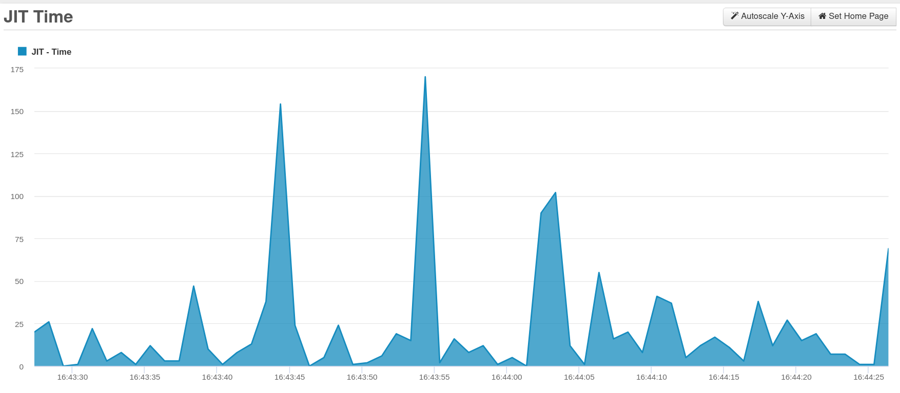
For further JIT related metrics you can use [JIT watch](https://github.com/AdoptOpenJDK/jitwatch) from AdoptOpenJDK


### Threads
When developing a high performance java backend it's essential to understand how many threads will serve user requests and what these threads are actually doing. If most of them are stacked in a blocking state there might be a huge IO bottleneck. Both tools show all the threads in the application with their names and current states(Threads tab in jvisualvm and **Resources->Threads** tab for FusionReactor).
Here is the FusionReactor Threads page.
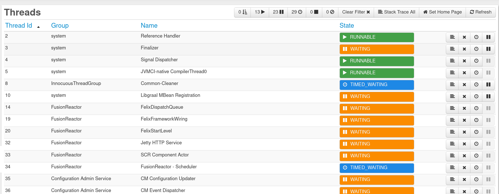
FusionReactor has few benefits over Jvisualvm in terms of Threads monitoring.
1. First we allow users to filter threads by the state(again, in case you are debugging IO problems it can come in handy).
2. Second, you can see the pretty formated stack traces for each individual thread.
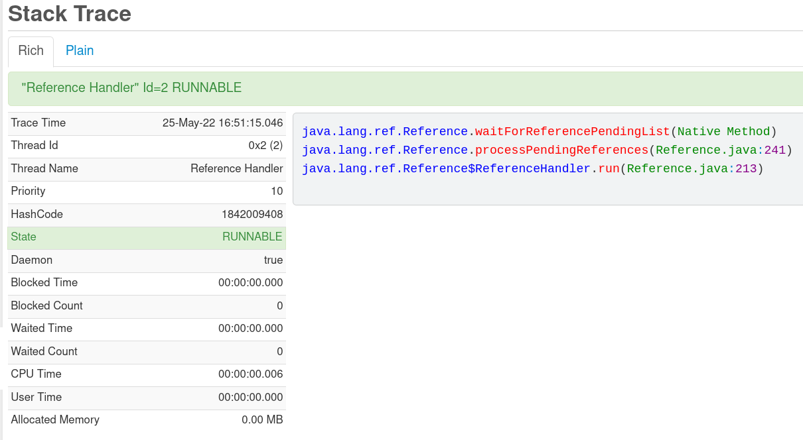
3. You can stop the thread
>(**REMEMBER** stopping threads is considering as a dangerous action, if the stopped thread was holding a monitor it may cause a deadlock in your application)


## JDBC
In terms of a web development apart from servlet container threads we as developers are interested in database performance(JDBC) and user experience in general.
Jvisualvm has a nice JDBC profiling feature that shows all sql queries sent to the database. In contrast, FusionReactor went further. In **JDBC** tab, apart from  all sql queries, users can check the ratio of successful queries, track sql exceptions. Also, for most SQL databases because of the way the delete and update queries work it's essential to reduce the amount of time a single transaction takes, to monitor it, FusionReactor has tabs with longest and slowest transactions respectively. 
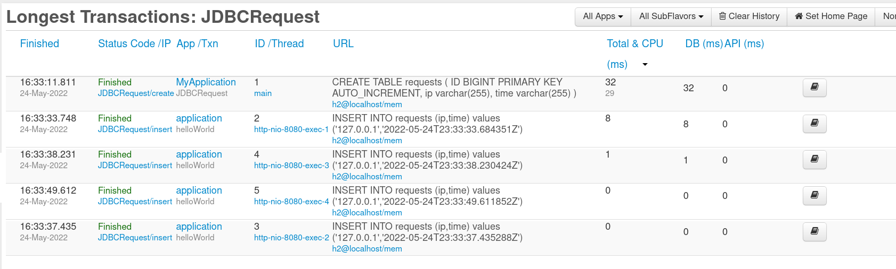

As java developers we get used to the abstraction that JPA specification brings us. Writing all sql queries using the object oriented entity system can speed up development dramastically. But do you know how much data the JPA generated queries will carry over the network ? To answer this question we introduced Transaction by memory tab that shows total allocated memory by query 

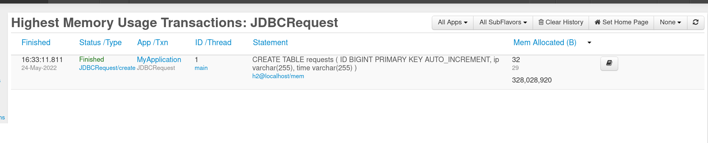

## System resources
Sometimes , we need to go out of the JVM abstraction to find an actual performance issues. In this case we have to check the resources of the actual machine where the java process is running. Jvisualvm has no insides about the host machine. In most cases people will connect to the server over the **ssh** and then use command line tools such as **top** and **ps** to check performance metrics. You don't have to do that with FusionReactor.  in a **System Resources** tab you can check
1. Network - how much data the host machine has sent over the wire
2. System memory 
3. CPU usage 
4. Disk usage - the read/write ratios over the period of time 
5. Processes - all the processes running on the host machine
And as always all these data is preserved in our servers
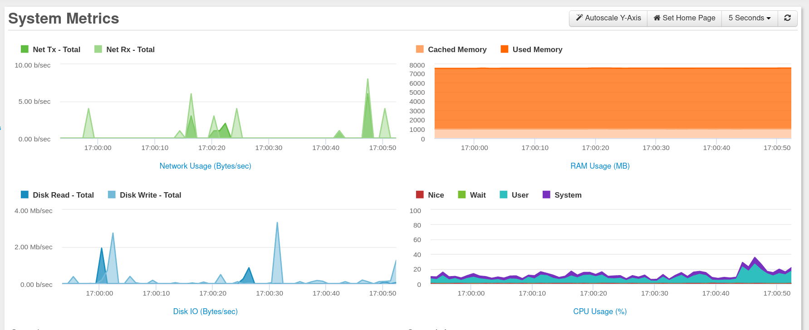

## Conclusion
As you can see , Jvisualvm is a great tool if you need a simple java profiling. However for production level issues FusionReactor has everything to make it easier for the end user to troubleshoot the problem related to JVM itself and the host machine it's running in. Apart from that, FusionReactor has tons of other features such as live debugging and application security which we didn't cover here. If you are interested and want to try FusionReactor on your own , please book a demo with us at [FusionReactor](https://www.fusion-reactor.com/)
