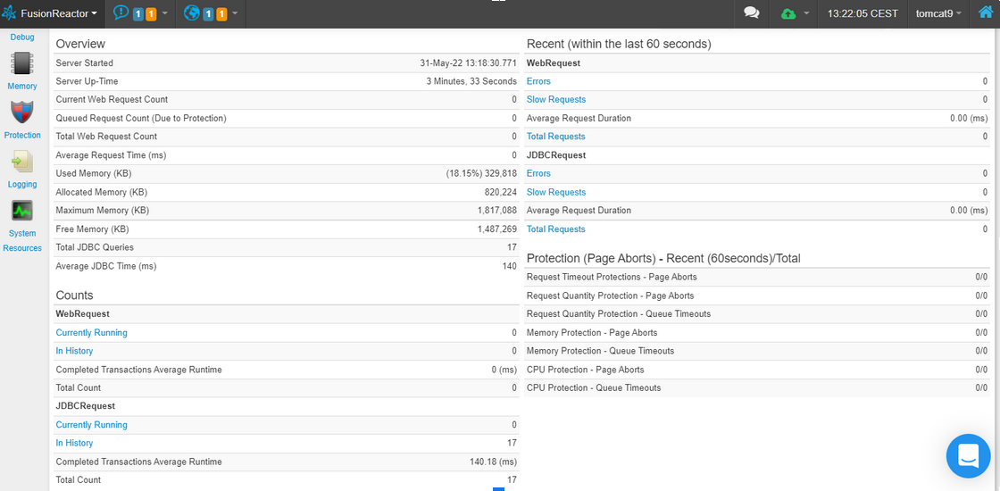
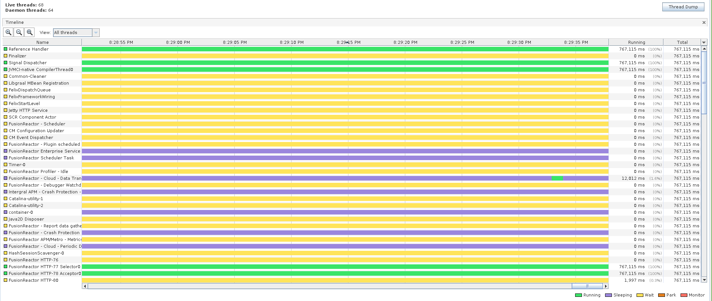
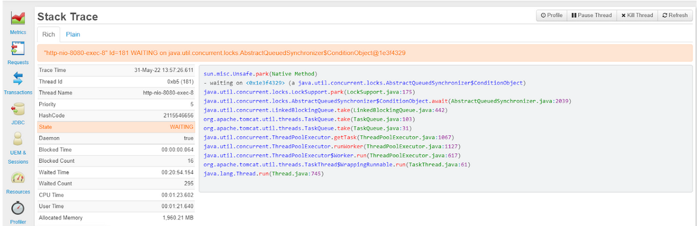
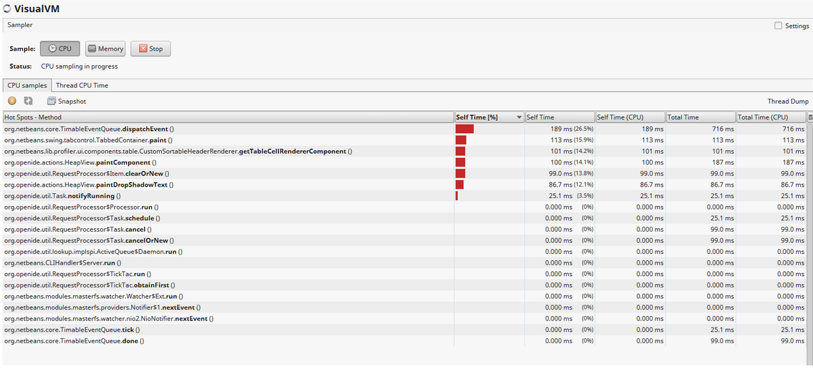
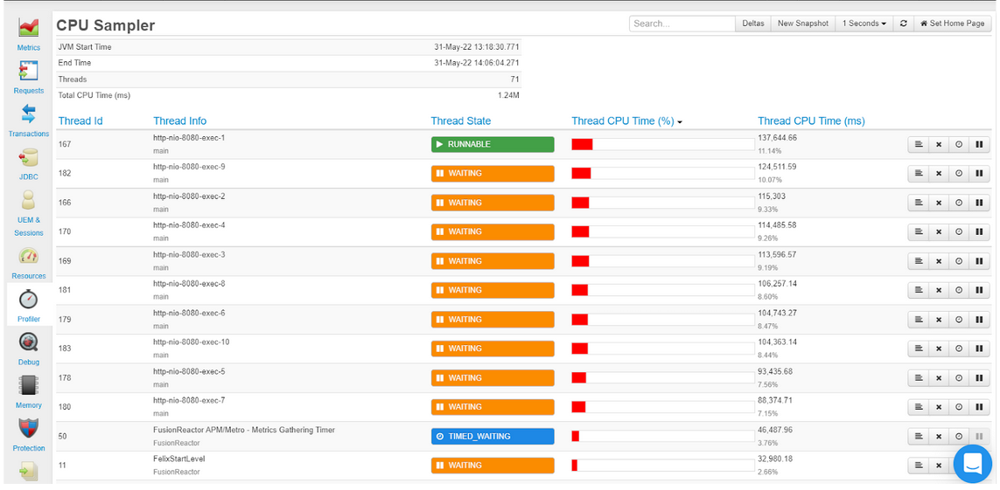
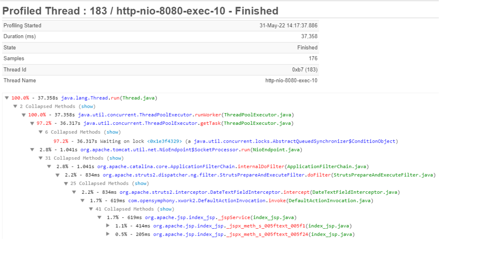
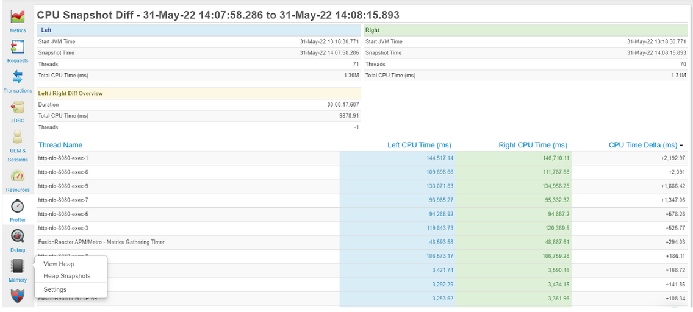
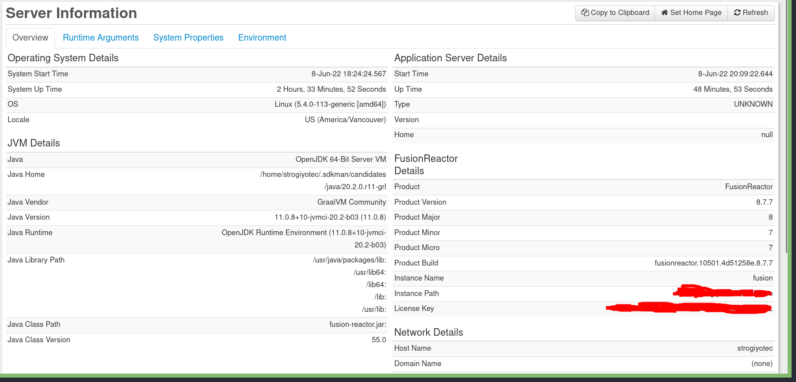
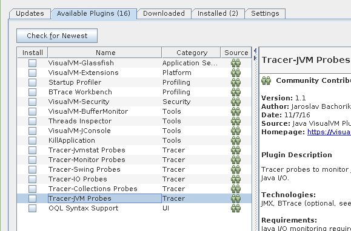
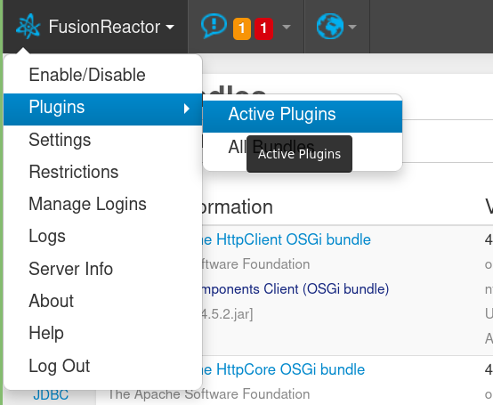

## Java VisualVM (jvisualvm) vs FusionReactor APM

## Table of content
1. [Introduction](#introduction)
2. [Java profiling](#java-profiling)
3. [FusionReactor vs Visualvm](#fusionreactor-vs-visualvm)
    1. [GUI vs Web](#gui-vs-web)
    2. [Default page](#default-page)
    3. [Main JVM metrics](#main-jvm-metrics)
        1. [GC](#gc)
        2. [Memory monitoring](#memory-monitoring)
        3. [JIT](#jit)
        4. [Threads](#threads)
        5. [JDBC](#jdbc)
        6. [Sampler and Thread CPU time](#sampler-and-thread-cpu-time)
        7. [System resources](#system-resources)
        8. [Plugins system](#plugins-system)
4. [Conclusion](#fusionreactor-right-for-you%3F)

## Introduction
A lot of new customers who have never tried to monitor their Java applications with FusionReactor might wonder what FusionReactor can do that VisualVM can't ,
If you have the same question in mind then welcome to a new article where we tried to compare both tools so you can decide which will work best for your use cases.

## Java profiling
Application profiling in general is a hard task. The usual purpose of profiling is to determine which sections of a program to optimize to increase its overall speed. Luckily , the awesome ecosystem of JVM makes it much easier for regular developers. 
But first you need to answer the simple question. What kind of monitoring do you need for your business? If you want to know how much time the Garbage collector takes to clean up dead objects or the class name that eats all of the available heap space ? If you answer yes to all then VisualVM and FusionReactor are good starting points for you. 
The curious reader might ask , how do these tools work under the hood ? How does the FusionReactor collect the metrics of your running java process ? The answer is **Java agents**

### Java agents
Java agents are a special type of class which, by using the Java Instrumentation API, can intercept applications running on the JVM, modifying their bytecode. The dynamic nature of Java makes it really easy to add these interceptors on the fly or specify agent as a command line argument to your application and if you will take a closer look at FusionReactor setup guide you will see that it literally asks you to specify an agent
```
java  -javaagent:/home/strogiyotec/Java/fusion/simple-spring-boot-app.jar -agentpath:/libfrjvmti_x64.so -jar application.jar
```

## FusionReactor vs VisualVM
Before we start, let's have a brief introduction to VisualVM . According to Oracle, `jVisualVM is a visual tool integrating command line JDK tools and lightweight profiling capabilities. Designed for both development and production time use`. It's distributed as a part of jdk installed in the host machine.
Now let's walk through a step by step comparison of both technologies. 
### GUI vs Web
Both FusionReactor and Java VisualVM are graphical interfaces to view stats of remote and local Java applications in real time.
VisualVM is a Java-based desktop application, whereas FusionReactor offers a web interface. 
VisualVM also requires the client to have a JDK installed. Ideally, it should be easy to profile live applications in response to incident reports. FusionReactor offers a web interface so anyone with a web browser can profile an application.

What is the big deal here ? Our team in FusionReactor believes that fast response to production level problems is essential for all businesses in respect to their customers. In case when the dev team is not available , non technical people won't be able to(without proper training) install jdk , launch VisualVM , connect to the production environment and take a live snapshot of the issue. With FusionReactor it is just a matter of opening a new tab in the browser that everyone with an internet connection can do .

### Default page
To compare both tools, we have prepared a simple spring-boot project packaged as a single [fat jar](https://docs.spring.io/spring-boot/docs/current/reference/html/executable-jar.html). The application is running on port 8080 and has a single GET endpoint `/hello` which inserts a random row into the in memory H2 database. The source code is available [here](https://github.com/strogiyotec/fusion-reactor-jvisualvm-blog)(Check out the github repo on how to build and run the project). Now when the project is up and running let's open VisualVM( typing `jvisualvm` in terminal should be enough if you have jdk installed).


From this list choose your application by pid(in this case it's 70017)
The image above shows how the user interface in VisualVM will look for openjdk 11.


In the default **Overview** tab you can see
1. JVM flags that were passed to java process(in this case no flags)
2. The JVM version and vendor
3. Other system properties

What about FusionReactor ? First you need to run the jar file with a Java agent attached. The command will look like this
```
java  -javaagent:/fusionreactor.jar=address=8088 -agentpath:/libfrjvmti_x64.so \
-Dfrlicense=LICENSE_NUMBER \
-Dfradminpassword=COMPICATED_PASSWORD \
-jar simple-spring-boot-app.jar
```
Once the app is deployed, open the admin page at the browser `http://localhost:8088` (the password will be the one specified by the `Dfradminpassword` parameter). 
This is the default interface 

FusionReactor is a complete monitoring tool so it will offer a lot more capability. Rather than covering the JVM process itself, FusionReactor also gives a whole overview of the underlying machine that hosts the JVM.
## Main JVM metrics
In this section we are going to compare how both tools deal with JVM metrics such as Garbage collection, memory monitoring , Threads activity and Just in time compilation(JIT)
### GC
Both VisualVM and FusionReactor support the insides of the garbage collector used by the application. The screen below shows how GC tab looks like in Jvisualvm

You can see main GC statistics here such as 
1. Number of collections
2. Eden , Survivor , Old and Metaspace sizes. 

Statistics refresh rate can be adjusted with a dropdown in the top left corner.
To tune garbage collection settings for performance, we need to know which garbage collector the application is using. In this interface it's hard to tell which type of garbage collector it is.
 There are many GC types the JDK ships and defaults vary between versions and vendors. For our demo application, VisualVM shows a small green label called **G1 Evaluation Pause** suggesting that the Garbage First (G1) collector is being used.
 
Let's take a look at the FusionReactor interface for GC. First go to the **Resources** tab and open **Garbage collection** section.  


With simpler screens it is a bit easier to tell which collector is used: The chart labels suggest that the G1 collector is being used. FusionReactor features many of the charts from VisualVM so new users coming from VisualVM won't have any trouble understanding the UI .In addition to that FusionReactor brings a lot more features 
1. it automatically records and persists garbage collection logs. With VisualVM you will have to collect these logs manually.
2. How much time each GC generation took (Old and Young)
3. The number of garbage collections per second(for both generations)
4. The statistics on Freed memory after GC

### Memory monitoring 
Next let's compare Memory monitoring starting with VisualVM


As you can see VisualVM doesn't give you a lot of insides on application memory expect for the total Heap allocation. 
Heap is a good metric to start with, but I feel this is not enough to troubleshoot the actual cause of a memory related issue. 

How is FusionReactor different? 
First, it has a lot more tabs for memory monitoring under the **Resources** tab. The default page is the **Memory overview** 

It shows: 
1. Heap allocation
2. Non-Heap allocation
3. CodeHeap(profiled and non-profiled nmethods)
4. Compressed Class Space
5. FusionReactor also shows the amount of memory that each generation takes
    1. Eden Space
    2. Old Space
    3. Survivor Space

As with garbage collection, all metrics are recorded and persisted for future viewing. 
Most java servers are running on top of servlet containers such as Tomcat or Jetty , if you need to see how many buffers are used to store HTTP requests then **Buffer Pools** tab will be your way to go(VisualVM doesn't support it natively you will have to install a third party plugin to see it , We come back to this later when we compare plugins system)

### JIT
JIT compilation can be a silent performance killer particularly when the compiler makes wrong assumptions about the code causing it to recompile hot methods again and again wasting CPU cycles. VisualVM doesn't offer any JIT related information. FusionReactor's **Resources** tab plots JIT compilation time. It can be filtered by specific time periods. 


For more JIT related metrics consider trying [JIT watch](https://github.com/AdoptOpenJDK/jitwatch) from AdoptOpenJDK


### Threads
When developing a high performance Java backend it's essential to understand how many threads will serve user requests and what these threads will actually do. If most of them are stacked in a blocking state there could be a huge I/O bottleneck. Both tools show all the threads in the application with their names and current states(This is shown in Threads tab in VisualVM and **Resources->Threads** in FusionReactor).

Let's start with a VisualVM 

VisualVM plots all the threads into a single page. There you can see threads by name, their current status. One of the biggest disadvantage here is that you can't filter by Thread name which makes monitoring a lot harder.

Here is the FusionReactor Threads page.

FusionReactor has a few benefits over VisualVM in terms of Threads monitoring. In this page you can
1. Filter threads by their states(This is useful for debugging I/O problems it can come in handy).
2. Profile a specific thread - provides a detailed profile, which analyzes down to method level of the performance and time spent in each method
3. Run a stacktrace from a specific thread - which enables you to easily pinpoint why a specific thread is not performing as it should or is in a specific state(for example, this thread is waiting on `take` method which is blocking)

4. From the stack Trace, you can also see many other details about the thread - name, ID, state, wait time, CPU time, User time, allocated memory etc.
5. You can stop any threads
>(**REMEMBER** stopping threads is considering as a dangerous action, For example if the stopped thread was holding a monitor it may cause a deadlock in your application)


## JDBC
In terms of web development apart from servlet container threads, developers are interested in database performance(using JDBC) to ensure a good user experience.
VisualVM has a nice JDBC profiling feature that shows all SQL queries sent to the database. Similarly, FusionReactor offers JDBC profiling with some additions. In the **JDBC** tab, apart from  all SQL queries, users can check the ratio of successful to unsuccessful queries and track sql exceptions. Also, for most SQL databases because of the way the delete and update queries work, it's essential to reduce the amount of time a single transaction takes. To monitor transaction time, FusionReactor has tabs to view the longest and slowest transactions respectively. 


Java developers enjoy the abstraction that the JPA specification brings us.
Performing all database operations through an "object relational mapping" library(ORM) can speed up development, reduce mistakes, and decouple business logic from the particular data store.  An alternative is to manually write queries and map their results to native data structures, but this can be duplicative, labor intensive, and error prone. Therefore, it makes sense to abstract away the most common operations. However, without easy introspection into how the ORM maps methods to queries on a per-operation basis, how does one know what the network load will be like in practice? How does one identify low-hanging queries to optimize without seeing the SQL in code? Even with the SQL queries available, how does one measure which ones are actually bottlenecks in production scenarios?

To answer these questions FusionReactor offers the **Transaction by Memory tab** which shows the total allocated memory per query 


## Sampler and Thread CPU Time
If you want to profile your java application both FusionReactor and VisualVM gives you a tooling to do it.

The sample page in VisualVM allows you to record the CPU usage by each thread


What about FusionReactor ? It gives you a lot more capabilities with a cleaner UI. You have to open Profiler Page to use live Profiling feature.

In this page you can:
1. See the **Stack Trace** page(same as we discussed in the [Thread](#threads) section)
2. In the **Stack Trace** page you can click on each method in the stacktrace and see decompiled source code of the underlying class

3. Using the “Delta” capability in FR, you can compare thread CPU information in real time
4. The snapshot feature will allow you to take CPU snapshots and then perform a Diff of any of those snapshots in a simple to use interface


## System resources
Sometimes ,  the cause of performance issues originate or are the result of interactions outside the JVM. In these cases a reasonable first step is to check the resources of the machine running the Java process.
VisualVM unfortunately does not report metrics for the host machine. In the case of Linux hosts one would usually connect to the server over **ssh** and use command line tools like **top** and **ps** to view machine resources. FusionReactor serves this use case with its convenient **System Resources** tab.
It plots several useful machine metrics

In the System tab you can check
1. Network. How much data the host machine has sent over the wire
2. System memory 
3. CPU usage 
4. Disk usage. The read/write ratios over some period of time 
5. Processes. All the processes running on the host machine


As with the other metrics, this data is persisted on our servers so you can respond to and understand incidents after they happen.


## Plugins system
VisualVM has few Plugins that you can install with the **View->Plugins** button. Most of these plugins only give you a few features to an existing VisualVM tabs(for example threads inspector and JVM probes)


Meanwhile FusionReactor plugin system brings a lot of integrations with popular frameworks and cloud providers
1. Templating solutions(such as Apache Mustache)
2. OSGI(Apache Felix, Apache Http OSGI bundle etc.)
3. Message queues(Apache Kafka)
4. Servlet Containers(Tomcat,Jetty etc)
5. Cloud providers(AWS)
6. Dead lock detector
And a lot more. You can see the list of all available plugins in the Plugins tab



## FusionReactor right for you?
VisualVM is a great tool for a simple Java profiling.FusionReactor brings profiling to the next level to meet the needs of your organization's production applications. A web-based client allows anyone to see key, real-time metrics when it matters. From JVM and common host machine metrics, to live debugging and tools to harden your application's security(both of these features were not covered in this blog).
FusionReactor can help you reach your observability and live operations goals.
If you are wondering whether FusionReactor is the right observability solution for your project, please feel free to reach out for a personalized demo at [FusionReactor](https://www.fusion-reactor.com/)
